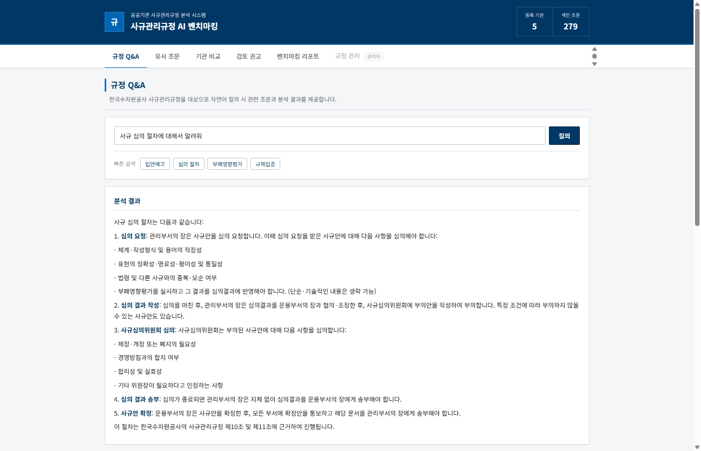
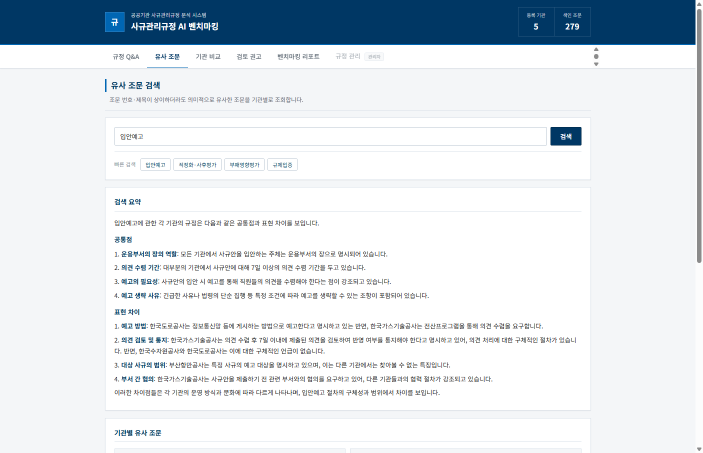
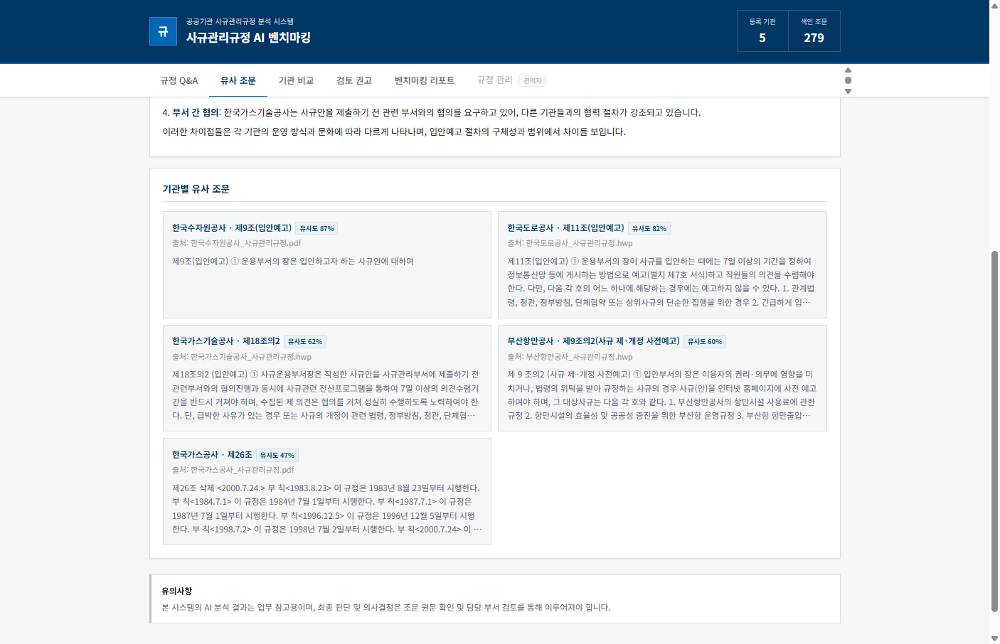
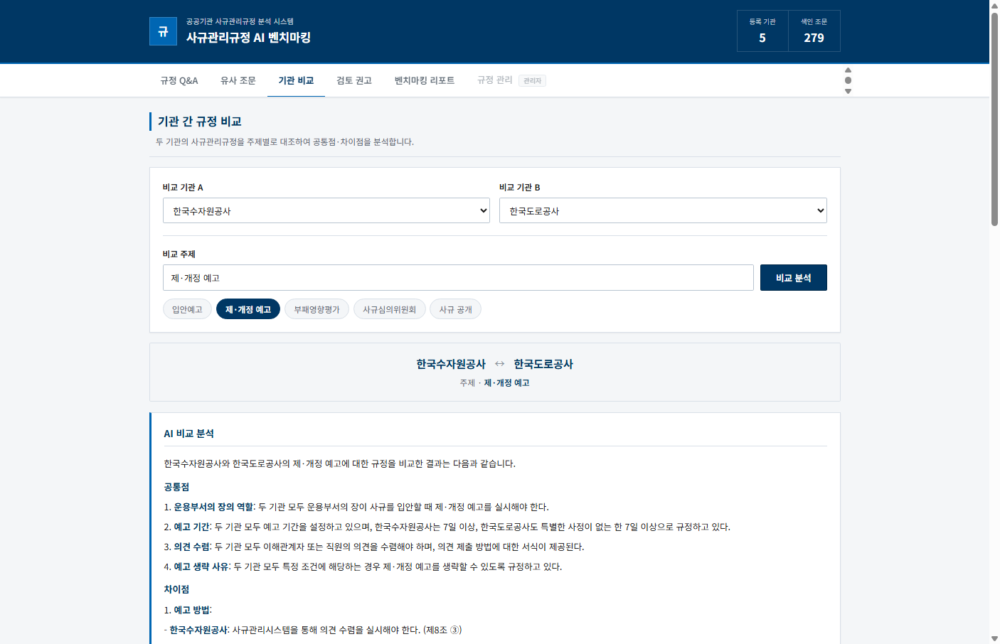
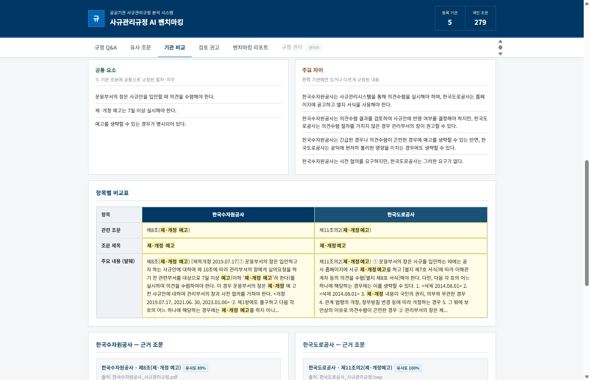
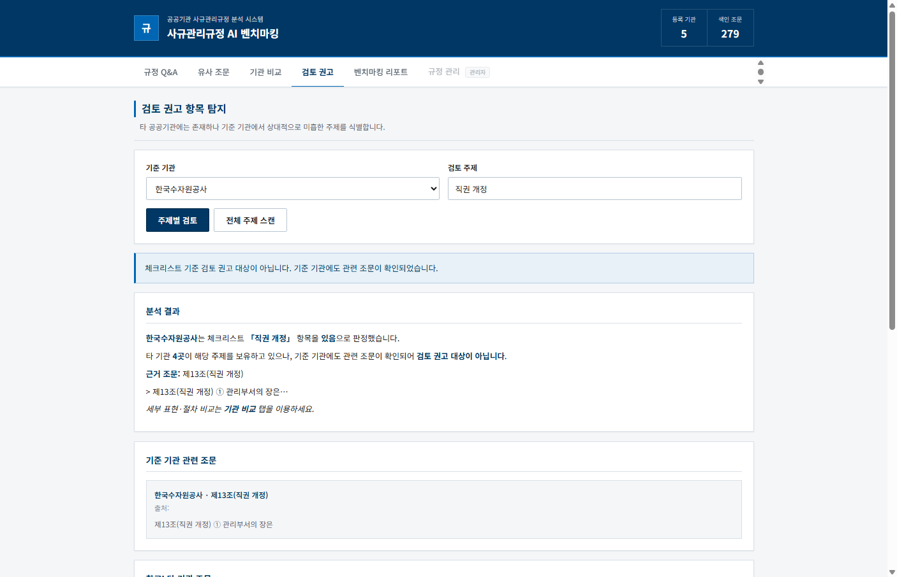
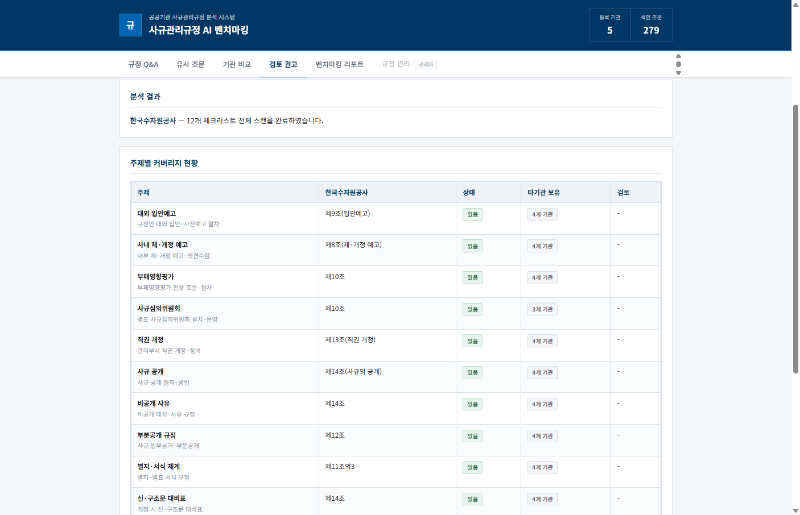
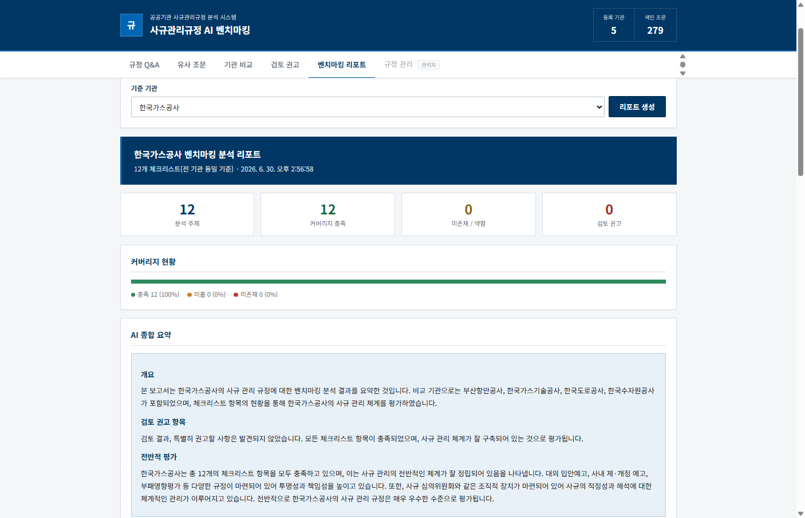
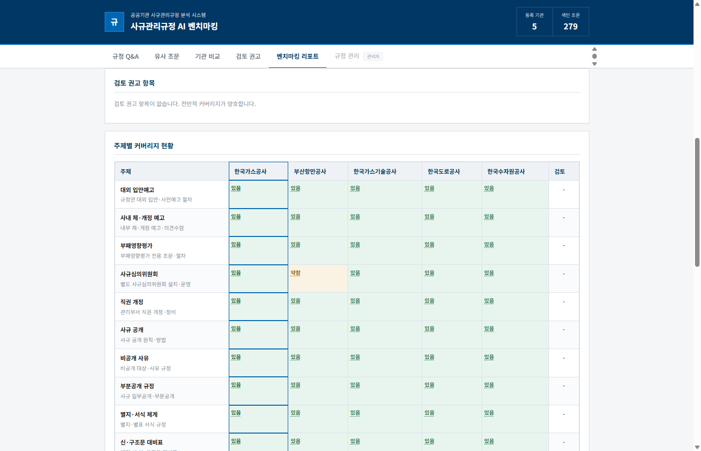

# 🏛️ 사규관리규정 AI 벤치마킹

> 공공기관 **사규관리규정**을 AI로 검색·비교·벤치마킹하는 웹 플랫폼

조문을 일일이 넘기며 찾을 필요 없이, **자연어 질의** 한 번으로 관련 규정을 찾고, **타 공공기관 사례**와 나란히 비교할 수 있습니다.  
12개 체크리스트로 “우리 기관에 이 항목이 있는지”를 한눈에 확인하고, AI가 **보완이 필요한 주제**까지 짚어 줍니다.

---

## ✨ 주요 기능

| 메뉴 | 설명 |
|------|------|
| 💬 **규정 Q&A** | 한국수자원공사 사규관리규정 대상 — 질문만 입력하면 관련 조문 + AI 답변 |
| 🔎 **유사 조문** | 조문 번호·제목이 달라도, **의미가 비슷한** 조문을 기관별로 탐색 |
| ⚖️ **기관 비교** | 두 기관을 같은 주제로 대조 — 공통점·차이점·근거 조문까지 |
| 🔔 **검토 권고** | 타 기관에는 있는데 우리 기관만 약한 주제를 자동 탐지 |
| 📊 **벤치마킹 리포트** | 등록된 기관 × 12개 체크리스트 히트맵 + AI 종합 요약 |
| 🔒 **규정 관리** | HWP/PDF 업로드·재색인 *(관리자 전용)* |

---

## 🛠️ 기술 스택

| 구분 | 기술 |
|------|------|
| ⚙️ Backend | FastAPI, Python 3.11+ |
| 🎨 Frontend | HTML / CSS / Vanilla JS |
| 🗄️ DB | Supabase PostgreSQL + **pgvector** |
| 🤖 AI | OpenAI Embedding + LLM (`gpt-4o-mini`) |
| 📄 문서 파싱 | PDF, HWP (`pyhwp`) |

### 🧠 벤치마킹 판정 방식 (Hybrid)

| 단계 | 기준 | 결과 |
|------|------|------|
| 1️⃣ | 조문에 **앵커 키워드** 확인 | ✅ `있음` |
| 2️⃣ | 없으면 **의미 검색** (유사도 ≥ 0.40) | ✅ `있음` |
| 3️⃣ | 유사도 0.22 ~ 0.40 | ⚠️ `약함` |
| 4️⃣ | 그 미만 | ❌ `없음` |

> `사규심의위원회` 등 일부 주제는 **strict** 모드 — 앵커 없이는 `있음`으로 인정하지 않습니다.

### 📋 12개 체크리스트

`대외 입안예고` · `사내 제·개정 예고` · `부패영향평가` · `사규심의위원회` · `직권 개정` · `사규 공개` · `비공개 사유` · `부분공개 규정` · `별지·서식 체계` · `신·구조문 대비표` · `사규 해석` · `사규 적정화`

---

## 🖥️ 화면 구성

상단 **헤더**(등록 기관·색인 조문 수)와 **탭 메뉴**는 스크롤해도 화면 위에 고정됩니다.  
아래 스크린샷은 `img/` 폴더에 순서대로 저장되어 있습니다.

---

### 💬 1. 규정 Q&A

**“사규 심의 절차가 어떻게 되나요?”** — 이렇게 평소 말하듯 질문하면 됩니다.  
AI가 한국수자원공사 사규관리규정에서 관련 조문을 찾아, **절차를 단계별로** 정리해 줍니다.



**👆 화면에서 볼 수 있는 것**

- **질의창** — “입안예고 기간은?”처럼 자연어로 질문합니다. 옆 **질의** 버튼을 누르면 분석이 시작됩니다.
- **빠른 검색 칩** — 자주 찾는 주제(입안예고, 심의 절차, 부패영향평가 등)를 클릭하면 질의창에 바로 채워집니다.
- **분석 결과** — AI가 조문 원문만 근거로 답변합니다. 예시 화면처럼 심의 요청 → 결과 작성 → 위원회 심의 → 송부 → 확정 순으로 **번호 목록**으로 정리됩니다.
- **근거 조문** — 답변의 출처가 되는 조문(예: 제10조, 제11조)과 본문 발췌, 유사도가 함께 표시됩니다.

> 💡 **Tip** — 규정 Q&A는 **한국수자원공사** 조문만 대상입니다. 다른 기관 규정은 **유사 조문**·**기관 비교** 메뉴를 이용하세요.

---

### 🔎 2. 유사 조문

기관마다 조문 번호와 표현이 달라도, **내용이 비슷한 조문**을 찾아 줍니다.  
“입안예고”를 검색하면 **등록된 각 기관**에서 어떤 조문이 해당하는지, **유사도와 함께** 보여 줍니다.

#### 📌 상단 — 검색 & AI 요약



**👆 화면에서 볼 수 있는 것**

- **검색어 입력** — 비교하고 싶은 주제 키워드를 넣습니다. (예: `입안예고`)
- **검색 요약** — AI가 등록된 기관들의 조문을 읽고 **공통점**(운용부서 역할, 의견 수렴 기간, 예고 필요성, 생략 사유 등)과 **표현 차이**(예고 방법, 의견 검토 절차, 대상 범위, 부서 간 협의)를 한 번에 정리해 줍니다.
- 한 기관씩 파일을 열어 비교할 필요 없이, **“다른 기관은 어떻게 써 놨는지”** 큰 그림을 먼저 파악할 수 있습니다.

#### 📌 하단 — 기관별 조문 카드



**👆 화면에서 볼 수 있는 것**

- **기관별 유사 조문** — 등록된 기관마다 매칭 조문이 카드 형태로 나열됩니다.
- **유사도 배지** — Embedding 점수를 %로 표시합니다. (예: 한국수자원공사 87%, 한국도로공사 82% …)
- **출처·본문** — `한국수자원공사_사규관리규정.pdf`처럼 원본 파일명과 조문 본문 일부가 함께 보여, **원문 확인**으로 바로 이어갈 수 있습니다.

---

### ⚖️ 3. 기관 간 규정 비교

**A 기관 vs B 기관**, 같은 주제로 **정면 비교**합니다.  
“우리와 도로공사, 제·개정 예고는 어디가 같고 어디가 다른가?” 같은 질문에 답합니다.

#### 📌 상단 — 비교 설정 & AI 분석



**👆 화면에서 볼 수 있는 것**

- **기관 A / B 선택** — 드롭다운에서 두 기관을 고릅니다.
- **비교 주제** — 직접 입력하거나, 아래 **pill 버튼**(입안예고, 제·개정 예고, 부패영향평가 …)을 눌러 빠르게 선택합니다. 선택된 주제는 진한 색으로 표시됩니다.
- **비교 분석** — 주제 입력란 옆 버튼으로 실행합니다.
- **결과 배너** — `한국수자원공사 ↔ 한국도로공사` · `주제 · 제·개정 예고`처럼 **무엇을 비교했는지** 한눈에 확인합니다.
- **AI 비교 분석** — 공통점(예고 기간 7일, 의견 수렴 의무)과 차이점(예고 방법, 생략 조건)을 **서술형**으로 정리합니다.

#### 📌 하단 — 공통·차이 & 비교표



**👆 화면에서 볼 수 있는 것**

- **공통 요소 / 주요 차이** — 조문명·글자 수가 아니라, **실질적인 규정 내용**(절차, 의무, 예외) 기준으로 AI가 추출합니다.
- **항목별 비교표** — 관련 조문 번호, 제목, 본문 발췌를 **좌우로 나란히** 배치해 diff처럼 읽을 수 있습니다.
- **근거 조문** — 각 기관의 매칭 조문 전문과 유사도(89%, 100% 등)가 하단에 붙어, **표 → 원문** 흐름으로 검토할 수 있습니다.

---

### 🔔 4. 검토 권고 항목 탐지

**“다른 공공기관에는 있는데, 우리 기관 규정만 빠진·약한 항목은?”**  
체크리스트 12개 기준으로 자동 판정하고, **검토가 필요한 주제**를 알려 줍니다.

**검토 권고 조건** — 기준 기관이 `없음` 또는 `약함` **이면서**, 타 기관 **2곳 이상**이 `있음`일 때

#### 📌 상단 — 주제별 검토



**👆 화면에서 볼 수 있는 것**

- **기준 기관 + 검토 주제** — 예: 한국수자원공사 × `직권 개정`
- **주제별 검토 / 전체 주제 스캔** — 하나만 볼지, 12개를 한꺼번에 볼지 선택합니다.
- **상태 알림** — 파란 박스: “검토 권고 대상이 **아닙니다**” — 기준 기관에도 조문이 있다는 뜻입니다.
- **분석 결과** — 체크리스트 판정(`있음`), 근거 조문(제13조), **타 기관 보유 현황**을 문장으로 설명합니다.
- **기준 기관 관련 조문** — 판정 근거가 된 조문 본문을 카드로 보여 줍니다.
- **참고: 타 기관 조문** — 권고는 아니지만, 세부 비교가 필요할 때 타 기관 사례를 참고할 수 있습니다.

#### 📌 하단 — 전체 주제 스캔



**👆 화면에서 볼 수 있는 것**

- **12개 체크리스트 표** — 주제별로 기준 기관 상태(`있음`/`약함`/`없음`), 근거 조문, **“타 기관 N개 보유”** 열이 한 표에 정리됩니다.
- **검토 권고 항목** — 실제로 권고가 필요한 주제만 하단 카드로 따로 모읍니다. (예: 부산항만공사 × 사규심의위원회 → `약함`)
- **색상 뱃지** — 🟢 있음 · 🟠 약함 · ⚪ 없음 — 표만 훑어도 **어디가 구멍인지** 바로 보입니다.

---

### 📊 5. 벤치마킹 리포트

한 기관을 **기준**으로 잡고, **등록된 기관 전체**를 12개 체크리스트로 **한 장의 리포트**로 뽑습니다.  
회의 자료·내부 보고용으로 바로 쓸 수 있는 **종합 분석 화면**입니다.

#### 📌 상단 — 요약 & AI 종합 의견



**👆 화면에서 볼 수 있는 것**

- **기준 기관 선택 → 리포트 생성** — 예: 한국가스공사
- **4개 통계 카드** — 📌 분석 주제 12 · ✅ 충족 12 · ⚠️ 미존재/약함 0 · 🔔 검토 권고 0
- **커버리지 progress bar** — 충족·약함·미존재 비율을 색 띠로 시각화합니다.
- **AI 종합 요약** — “개요 → 검토 권고 → 전반적 평가” 순의 **3~5문단** 서술. 체크리스트 숫자와 맞는 내용만 근거로 작성합니다.
- **검토 권고 항목** — 보완이 필요한 주제가 있으면 여기에 표시됩니다. (없으면 “양호” 메시지)

#### 📌 하단 — 히트맵 & 상세 리포트



**👆 화면에서 볼 수 있는 것**

- **주제별 커버리지 히트맵** — 가로 **등록 기관** × 세로 12개 주제. 셀 색으로 `있음`/`약함`/`없음` 표시.
- **기준 기관 열 강조** — 선택한 기관 열에 **파란 테두리** — “우리 기관이 어디서 튀는지” 세로로 추적하기 쉽습니다.
- **셀 hover 팝오버** — 마우스를 올리면 조문 발췌, 매칭 키워드, **판정 근거**(키워드 확인 / AI 유사도)가 뜹니다.
- **상세 리포트 (Markdown)** — 체크리스트 항목별 현황·활용 안내를 텍스트로도 제공합니다.

---

## 🏢 등록된 기관

아래는 **현재 색인에 포함된 기관**입니다. 규정 파일을 추가·업로드하면 기관 수는 늘어날 수 있습니다.  
실시간 **등록 기관·색인 조문 수**는 화면 상단 헤더 또는 `GET /api/stats`에서 확인합니다.

| 기관 | 파일 |
|------|------|
| 🚢 부산항만공사 | HWP |
| 🔥 한국가스공사 | PDF |
| 🔧 한국가스기술공사 | HWP |
| 🛣️ 한국도로공사 | HWP |
| 💧 한국수자원공사 | PDF |

---

## 🚀 설치 및 실행

### 1️⃣ 환경 변수

```powershell
copy .env.example .env
```

| 변수 | 설명 |
|------|------|
| `OPENAI_API_KEY` | 🤖 Embedding + LLM **(필수)** |
| `DATABASE_URL` | 🗄️ Supabase PostgreSQL pooler URI |
| `OPENAI_MODEL` | LLM 모델 (기본 `gpt-4o-mini`) |
| `OPENAI_EMBEDDING_MODEL` | Embedding (기본 `text-embedding-3-small`) |
| `OPENAI_SSL_VERIFY` | 회사망 SSL 이슈 시 `false` |

### 2️⃣ 의존성 설치

```powershell
python -m venv .venv
.\.venv\Scripts\activate
pip install -r requirements.txt
```

### 3️⃣ DB 스키마 & 초기 데이터

Supabase SQL Editor에서 `scripts/supabase_schema.sql` 실행 후:

```powershell
python scripts/upload_to_supabase.py
```

> 📁 `data/` 폴더에 HWP/PDF를 넣으면 서버 기동 시 **자동 동기화**됩니다.

### 4️⃣ 서버 실행

```powershell
python -m uvicorn backend.main:app --reload --port 8000
```

🌐 브라우저 → `http://localhost:8000`

### 5️⃣ 헬스 체크

```
GET /api/health
```

✅ `"checklist_count": 12`, `"benchmark_mode": "hybrid"` 이면 정상

---

## 📁 프로젝트 구조

```
public-regulation-ai/
├── backend/           # ⚙️ FastAPI 서버
├── frontend/static/   # 🎨 웹 UI
├── src/               # 🧠 분석·검색·파싱 로직
├── data/              # 📄 규정 원본 (HWP/PDF)
├── img/               # 🖼️ README 스크린샷
└── scripts/           # 🔧 DB·업로드·재색인
```

---

## 🔌 API 요약

| Method | Path | 기능 |
|--------|------|------|
| POST | `/api/search` | 💬 규정 Q&A |
| POST | `/api/similar` | 🔎 유사 조문 |
| POST | `/api/compare` | ⚖️ 기관 비교 |
| POST | `/api/gap` | 🔔 검토 권고 (주제별) |
| POST | `/api/gap/scan` | 🔔 검토 권고 (전체) |
| POST | `/api/report` | 📊 벤치마킹 리포트 |
| GET | `/api/stats` | 📈 등록 기관·조문 수 |
| GET | `/api/health` | ❤️ 서버 상태 |

---

## ⚠️ 유의사항

AI 분석 결과는 **참고용**입니다.  
최종 판단은 반드시 조문 **원문**과 담당 부서 검토를 거쳐 주세요.
